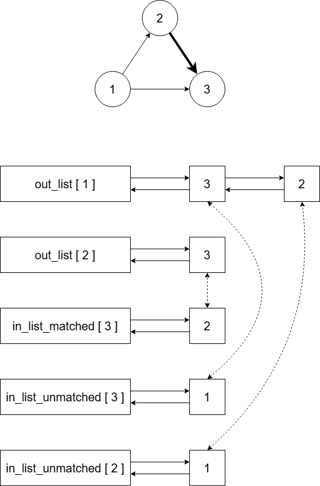

# Representation of Graphs with Bounded Arboricity

An implementation of the graph data structure described in `"Dynamic Representation of Sparse Graphs" by Gerth Stølting Brodal and Rolf Fagerberg (WADS 1999: 342-351)`.

## Sparse Graph

This repository provides an implementation of dynamic sparse graphs, which supports the following operations:

| Operation  | Time Complexity                   |
|:-----------|:----------------------------------|
| Adjacency  | *O*(**c**) worst case             |
| Insertion  | *O*(**1**) amortized              |
| Deletion   | *O*(**c** + log**n**) amortized   |

Where,   
- **n** = number of vertices in the graph    
- **c** = bound on the arboricity of the graph    

## Sparse Graph Generator

A utility to generate graphs with arboricity bounded by a given value.   
The steps of generation are as follows:

- Provide **n** (number of vertices) and **c** (arboricity bound) as input.

- **c** random spanning trees are generated on the vertex set V = {0, 1, ..., **n** - 1}.   
  There are multiple ways to generate a uniformly random spanning tree:
    - Generate a random [prüfer sequence](https://en.wikipedia.org/wiki/Pr%C3%BCfer_sequence) and construct its equivalent tree.
    - Start with all the vertices as **n** connected components. Repeatedly pick two random connected components and connect them, until only one connected component remains.

- The union of the edge sets of all the generated trees is taken as the edge set of the final graph which is the output.

## 2-Approximation Algorithm to compute Arboricity

- This algorithm computes a 2-approximation of the arboricity of the graph.   
  2-approximation means the computed arboricity is at most twice the actual arboricity.

- It runs in *O*(**n** + **m**) time and uses *O*(**n** + **m**) space, where **n** = number of vertices, and **m** = number of edges.

- This algorithm will be helpful if the arboricity of the input graph is not known prior to execution.

- If it is known that the arboricity of the graph will remain bounded, then running this algorithm just once should be enough.

- If the arboricity changes(specifically increases) during execution, then this algorithm could be repeatedly run after some number of iterations of execution depending on the application and constraints.

## Dynamic Maximal Matching

A dynamic graph data structure which maintains a maximal matching over a sequence of edge insertions and deletions.   
The underlying structure is similar to the sparse graph structure which has been mentioned above.

| Operation  | Time Complexity                   |
|:-----------|:----------------------------------|
| Adjacency  | *O*(**c**) worst case             |
| Insertion  | *O*(**c**) amortized              |
| Deletion   | *O*(**c**) amortized              |
| Matching   | *O*(**1**) worst case             |

Where,   
- **c** = bound on the arboricity of the graph    
- Matching means given an input vertex, its matched vertex is the output

### Implementation

- Each vertex maintains three lists: **out_list**, **in_list_matched** and **in_list_unmatched**.

- Whenever the matching status of a vertex changes, it notifies the same to its out neighbours. This notification results in the updation of the lists **in_list_matched** and **in_list_unmatched**.

- We only have the liberty to traverse through **out_lists** as their sizes are bounded. The **in_lists** must be updated efficiently.

- All lists are implemented as a modified version of a doubly linked list. Each node in the list contains three pointers: **next**, **previous** and **external**.

- Consider an edge (**u**, **v**) oriented as (**u** -> **v**).   
  The **out_list** of **u** will contain an entry of **v**.   
  Exactly one of the appropriate **in_lists** of **v** will contain an entry of **u**.   
  Both entries will be connected to each other via **external** pointers.   

- Check the below image as an example. Only some lists have been depicted in the diagram.   
  Bold edge denotes a matched edge.    
  Dashed pointer denotes an **external** pointer.   

  

- The features of a normal doubly linked list are already known. The new **external** pointers help to efficiently update entries in the **in_lists**.

## References

- Gerth Stølting Brodal and Rolf Fagerberg, "Dynamic Representation of Sparse Graphs", WADS, pp. 342-351, 1999.

- Srinivasa R. Arikati, Anil Maheshwari, and Christos D. Zaroliagis, "Efficient computation of implicit representations of sparse graphs", Discrete Applied Mathematics, 1995.

- Manas Jyoti Kashyop and N. S. Narayanaswamy, "An invitation to dynamic graph problems: Upper bounds—II" Resonance, vol. 27, no. 9, pp. 1607–1624, 2022.

- Chandra Chekuri, Aleksander Bjørn Christiansen, Jacob Holm, Ivor van der Hoog, Kent Quanrud, Eva Rotenberg, and Chris Schwiegelshohn, "Adaptive out-orientations with applications," Proceedings of the 2024 Annual ACM-SIAM Symposium on Discrete Algorithms (SODA), pp. 3062–3088, 2024.